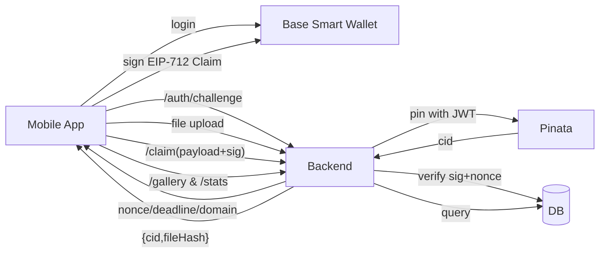

# Sunsettings Architecture (Non‑NFT, Base Smart Wallet + Pinata)

Purpose: Track which Base smart account uploaded which sunset photo without minting NFTs. Enable user galleries and “how many sunsets captured” stats. Store optional “beauty score” and coarse location.

## Summary
- Identity: Coinbase Smart Wallet (Base smart account, AA).
- Storage: Image blobs on Pinata (IPFS, CIDv1). Authorship records in a database.
- Binding: Off-chain EIP-712 signed claim links `{fileHash, cid}` to the user’s address.
- No on-chain writes now: zero gas; still cryptographically verifiable and replay-resistant.
- Store beauty score and blurred location (~500m–1km radius) per photo.



## Components
- Web App (React PWA)
  - Coinbase Smart Wallet Web SDK on Base for connect/login.
  - Uses browser file input, computes `SHA-256` → `bytes32 fileHash` client-side.
  - Uploads photo (server pins to Pinata).
  - Signs EIP-712 Claim and posts it to backend.
  - Map UI built with Mapbox GL JS for selecting/viewing locations and photo markers.
  - Display neighborhood-style labels (e.g., "Pankow, Berlin") instead of exact geoposition.

- Backend API (Next.js Route Handlers)
  - Lives under `/api/*` in the Next.js app (App Router).
  - Holds Pinata JWT.
  - Issues nonces, verifies signatures (EOA and smart accounts via EIP-1271; supports EIP-6492 envelopes where applicable).
  - Writes authorship records to DB.
  - Serves gallery and stats.
  - Integrates with Brightsky (https://brightsky.dev/) to fetch weather/astronomy data at upload time.
  - Computes the sunset beauty score using the OpenAI API (given Brightsky features and context), or validates a client-provided score.
  - Performs reverse geocoding (via Mapbox Geocoding API) on the blurred center to produce a human-readable `location_label` (e.g., neighborhood/city), stored with the photo.

- Storage
  - Pinata (CIDv1 base32) for photo content.
  - Database: Supabase (Postgres) for authorship and metadata, with Drizzle ORM for schema/migrations (and optional Supabase client for direct SQL/RPC).

## Data Model

Recommended tables (Postgres, hosted on Supabase; schema managed via Drizzle migrations):

```sql
create table users (
  address        bytea primary key, -- 20 bytes; store lowercase hex decoded
  created_at     timestamptz not null default now(),
  display_name   text,
  avatar_url     text
);

create table photos (
  id             bigserial primary key,
  address        bytea not null references users(address),
  cid            text not null,                    -- CIDv1 base32
  file_hash      bytea not null unique,            -- 32 bytes (SHA-256)
  timestamp_sec  bigint not null,                  -- upload/claim time (epoch seconds)
  score          smallint,                         -- optional 0..100 (or chosen scale)
  location_center_lat double precision,            -- optional blurred center latitude
  location_center_lon double precision,            -- optional blurred center longitude
  location_radius_m     integer,                   -- optional blur radius in meters (e.g., 500–1000)
  location_geohash      text,                      -- optional geohash (e.g., precision 6–7 ~ 0.6–1.2km)
  location_label text,                             -- optional human-readable label (e.g., "Pankow, Berlin")
  location_meta  jsonb,                            -- optional (e.g., {"country":"US","region":"CA"})
  signature      text not null,                    -- EIP-712 signature
  wallet_type    text not null,                    -- EOA | AA
  verified       boolean not null default false    -- set true after sig verification
);

create index photos_address_ts_idx on photos(address, timestamp_sec desc);
create index photos_location_geohash_idx on photos(location_geohash);
```

Notes:
- `file_hash` is the canonical dedup key (first claimant wins).
- `address` is the uploader’s smart account address.
- `score` and blurred location fields are optional and stored off-chain. Exact GPS coordinates should not be persisted; only the blurred center + radius (and/or geohash).

## Authorship Binding (Off-Chain EIP-712)

- The app asks the user to sign an EIP-712 “Claim” after pinning returns `{cid, fileHash}`.
- Backend verifies signature and inserts the record.
- No on-chain writes. The claim is still cryptographically bound to the user’s address.

### EIP-712 Domain
```
name:    "Sunsettings"
version: "1"
chainId: 8453 (Base mainnet) or 84532 (Base Sepolia during development)
verifyingContract: 0x0000000000000000000000000000000000000000 (sentinel for off-chain binding)
```

### EIP-712 Types and Message
Types `Claim`:
```
Claim = [
  { name: "cid", type: "string" },
  { name: "fileHash", type: "bytes32" },
  { name: "score", type: "uint16" },       // optional; can be 0 if unused
  { name: "timestamp", type: "uint64" },   // seconds epoch
  { name: "author", type: "address" },
  { name: "nonce", type: "uint256" },
  { name: "deadline", type: "uint256" }
]
```
Message example:
```
{
  cid: "bafybeigd...",            // CIDv1 base32
  fileHash: "0x...",              // SHA-256 of raw file bytes
  score: 87,                       // optional
  timestamp: 1727985600,           // client time when claiming
  author: "0xUserSmartAccount",
  nonce: 3,
  deadline: 1727990000
}
```

### Verification Rules (Backend)
- Recompute `fileHash` from uploaded bytes and ensure it matches.
- Check `deadline >= now()`; `timestamp` is within an acceptable skew window.
- Check `nonce` equals the server-issued nonce for `author`; then consume it.
- Verify signature:
  - EOA: recover signer from EIP-712; must equal `author`.
  - Smart account (Coinbase Smart Wallet): call `isValidSignature` (EIP-1271) on `author` via RPC. If an EIP-6492 envelope is used, unwrap and validate accordingly.
- Enforce uniqueness: reject if a record with the same `file_hash` already exists.

## API Endpoints (Next.js /api/*)

- `POST /api/auth/challenge`
  - Body: `{ address }`
  - Response: `{ nonce, deadline, domain }`
  - Issues a per-user nonce and a short-lived deadline; stores pending nonce.

- `POST /api/pin`
  - Auth: bind to the challenge/nonce session, or include `{address, signature, nonce}` in request to prove identity.
  - Multipart file upload. Server computes `SHA-256` → `fileHash`.
  - Pins to Pinata using server-side JWT. Returns `{ cid, fileHash }`.

- `POST /api/claim`
  - Body: `{ cid, fileHash, score?, timestamp, author, nonce, deadline, signature, location? }`
  - Server verifies the claim (rules above). If valid, inserts into `photos` with `verified=true` and optional blurred location fields (`location_center_lat`, `location_center_lon`, `location_radius_m`, `location_geohash`), `location_label`, and/or `location_meta`.
  - Score handling: server may compute/override the score using Brightsky data + OpenAI API, or validate a client-provided score against server-calculated bounds.
  - Returns `{ id }`.

- `GET /api/gallery/:address`
  - Returns paginated list of `{ cid, score?, timestamp, location? }` for a wallet.

- `GET /api/stats/:address`
  - Returns `{ sunsetCount, firstUploadAt, lastUploadAt }`.

## Web App Flow (React PWA + Coinbase Smart Wallet)

1) Connect
- User connects Coinbase Smart Wallet in the browser (Base); obtain smart account address.

2) Challenge
- Call `/auth/challenge` to fetch `{ nonce, deadline, domain }` for this address.

3) Upload & Pin
- Read file bytes from browser input; compute `SHA-256` to a `bytes32` `fileHash`.
- POST `/pin` with file; receive `{ cid, fileHash }`.

4) Sign Claim
- Construct EIP-712 Claim with `{ cid, fileHash, score?, timestamp, author, nonce, deadline }`.
- Ask wallet to sign typed data.

5) Claim Submit
- POST `/claim` with payload + signature (+ optional `location` data).
- On success, update UI and cache; photo visible in gallery.

6) View & Stats
- Query `/gallery/:address` and `/stats/:address` to render user’s gallery and count.

## Pinata Considerations
- Use CIDv1 base32 consistently in UI.
- Optionally include Pinata metadata `keyvalues` for convenience (e.g., `author`, `takenAt`, `region`), but treat DB as source of truth.
- Thumbnails or transformations can be generated asynchronously and stored with separate CIDs.

## Security & Abuse Mitigations
- Replay protection: per-user nonces + short-lived deadlines.
- Uniqueness: reject duplicate `fileHash` on insert (first claimant owns it).
- Signature verification: EOA recovery or EIP-1271 for smart accounts; support EIP-6492 if applicable.
- Rate limiting: per address and IP.
- Content moderation: size/type limits and optional NSFW checks before pinning.
- Privacy: never store raw precise GPS. Persist only blurred location as a center point plus radius (e.g., 500–1000m) and/or a geohash bucket, and a derived neighborhood/city label for display. Show maps with Mapbox using this blurred data and label (e.g., "Pankow, Berlin").

## Observability
- Log claim attempts, verification results, and Pinata responses (without leaking secrets).
- Metrics: uploads per day, claim success rate, average latency, dedup hits.

## Scalability
- DB indexes on `address,timestamp_sec` and unique `file_hash`.
- Use a CDN gateway for IPFS retrieval (Pinata or public gateway).
- Background jobs for thumbnail generation, score computation, and EXIF scrubbing.

## Future Migration (Optional On-Chain Anchor)
- Later, add an on-chain registry contract to anchor `{fileHash -> author}`.
- Reuse the same EIP-712 Claim format; submit to chain when permanence/composability is desired.
- Batch-anchor existing off-chain records if needed.
